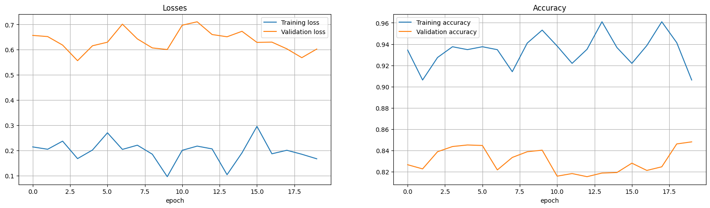
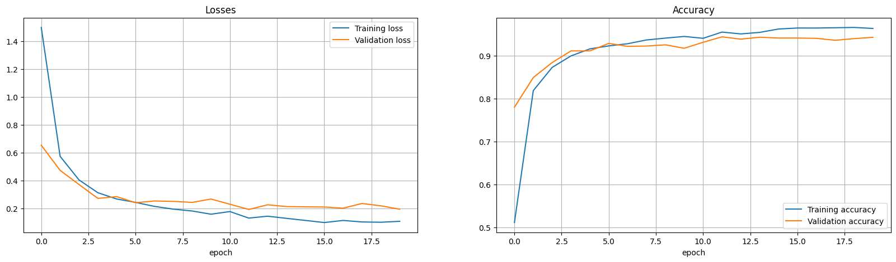

# Animal Classification Project
Miguel Gómez Prieto

Classification of an [animal dataset](https://www.kaggle.com/datasets/miguelxp/animalprediction) for a Kaggle competition  

---

## Dataset Analysis  
The dataset contains images of **10 animal classes**. During the initial analysis we observed:  
- **Number of classes**: 10 categories, unevenly balanced.  
- **Number of samples**: variable per class.  
- **Image dimensions**: not homogeneous, which required preprocessing with resizing.  

The following preprocessing techniques were applied:  
- Resizing all images to **128x128 pixels**.  
- Normalization of pixel values to the [0,1] range.  
- Data augmentation with rotations, horizontal flips, and zoom to improve generalization.  

---

## Models Tested  

### Large Model (CNN from scratch)  
A deep convolutional neural network was designed with several `Conv2D`, `BatchNormalization`, `MaxPooling`, and dense layers at the end.  

This model was the first to provide acceptable results, although it required **many epochs of training** due to the complexity of the problem.  

It was designed following basic computer vision principles: initial convolutional layers with few filters to capture edges and simple textures, progressively increasing depth to extract more complex patterns.  

BatchNormalization and MaxPooling layers were included to stabilize training and reduce dimensionality.  

Finally, dense layers with Dropout were added to combine features and attempt to reduce overfitting. This architecture aimed to balance representation capacity and generalization.  

**Main results:**  
- Reached a **validation accuracy of 96.5%** after 120 epochs.  
- Training was slower and showed significant overfitting, especially in the final epochs.  

---

### Oversampling  
The same model was tested with class balancing techniques through oversampling, adjusting the impact of the loss function depending on the number of samples per class.  
- **Result:** no significant improvements compared to the base model.  

  
*Results from the last 20 epochs; next time, we'll save all training sessions*
---

### Transfer Learning (VGG16 + ImageNet)  
*Transfer learning* was applied using **VGG16** with pretrained ImageNet weights.  
- Most layers were frozen, except for the last convolutional block.  
- The learning rate was reduced to **1e-4** and later to **1e-5**.  

For VGG, the images had to be preprocessed according to the model’s requirements (easily done with the Keras function).  

**Main results:**  
- Validation accuracy of **94.3%** after 20 epochs.  
- With fine-tuning and a smaller learning rate, it reached **95.7%**.  
- Better generalization and shorter training time compared to the model from scratch.  

---

### Ensemble  
The results of the following were combined:  
- The large model trained from scratch.  
- The two VGG16-based models.  

A **voting classifier** was used.  
- **Result:** the ensemble did not outperform the best individual model (fine-tuned VGG16), but it became the **second-best submission**.  

---

## Evaluation and Conclusions  
- The **handcrafted model** showed that it is possible to train from scratch, but it requires more resources and time and still achieves worse results.  
- **Transfer learning with VGG16** was the best strategy. By using a proven architecture and pretrained weights, it achieved higher accuracy with less computational effort.  
- The **ensemble** added robustness, although it did not improve the final metric.  
